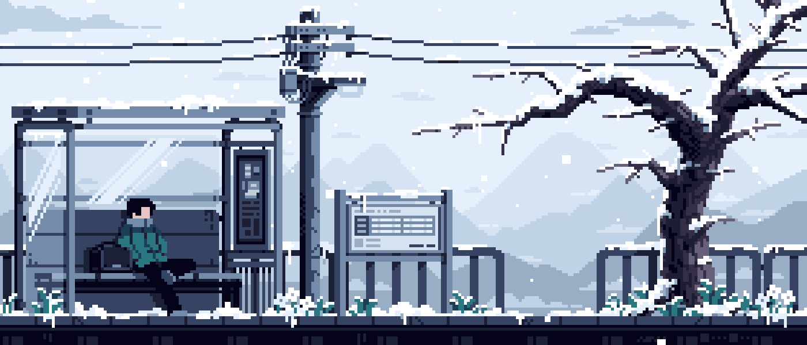

  

  <h1 style="color: #a259ff;">Hi there 👋 I'm Mohammad Faiz</h1>

  

---

### 🧑‍💻 About Me

I’m a dedicated **Front-End Developer** and **Web Designer**, actively exploring full-stack development. As an aspiring **SDE**, I build sleek UIs, collaborate on open-source projects, and love learning modern tech.

🔭 **Currently working on:**
- Enhancing the **MenuMate** web app
- Collaborating in **GSSoC '24**
- Diving deep into **MERN Stack**

💡 **Fun facts:**
- Passionate about UI/UX & accessibility
- Love building for real-world use cases
- I believe in *keeping the grind* 💪

---

### 🛠️ Tech Stack

  

---

### 🏅 GSSOC(24) Badges

  

---

### 📈 GitHub Stats

<table align="center" style="border: none;">
  <tr>
    <td align="center">
      
    </td>
    <td align="center">
      
    </td>
  </tr>
</table>

---

### 📫 Contact Me

  
  

